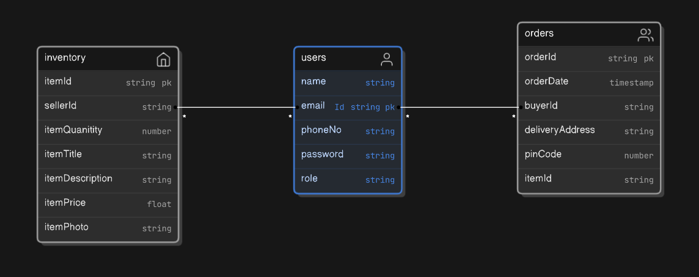

# spring-bazaar
A E-Commerce site built using Java Spring Boot and NextJs.

# Local Environment Setup
- Run `docker compose up` in server folder to spin up the mysql server container.
- Wait for mysql server to start until below lines are printed in console
```
2024-08-27T10:16:05.796829Z 0 [System] [MY-011323] [Server] X Plugin ready for connections. Bind-address: '::' port: 33060, socket: /var/run/mysqld/mysqlx.sock
2024-08-27T10:16:05.797043Z 0 [System] [MY-010931] [Server] /usr/sbin/mysqld: ready for connections. Version: '9.0.1'  socket: '/var/run/mysqld/mysqld.sock'  port: 3306  MySQL Community Server - GPL.
```
- After successful startup, log into mysql container using `docker exec -it <container_id> bash`
- Run `mysql -u root -p` and enter password to log into mysql
- Create a database `spring-bazaar` and then run the spring boot application.

## Requirements (v1)
### User (Buyer)
- User should be able to register on the platform
- User can order the products

### User (Seller)
- Seller can able to register on the platform
- Seller should be able to add products to it's inventory, and manage orders.
- Each order would have audit trail about it's delivery status.

## APIs
- user
    - /register
    - /login
- home
    - /home
- order
    - /purchase
- inventory
    - /addProduct
    - /updateProduct
    - /removeProduct
    - /viewOrders

## ER Digram


_Note: For V2, we will have Reviews table with fields such as item id, rating, review text, buyer id, etc._
